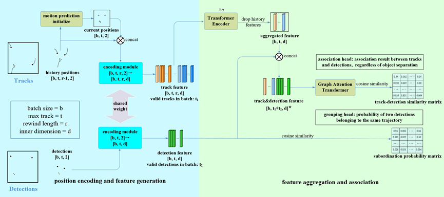

<div align="center">
<h1>ScatterTrack </h1>
<h3>Multi-Object Tracking with Separation in Deep Space</h3>
</div>


## Abstract
In deep space environment, some objects may split into several small fragments during movement, and these deep space objects often appear as points in satellite images. In this paper, we conduct research on multi-object tracking for these objects. Firstly, we propose a simulation dataset, ScatterDataset, which simulates the movement and separation of objects in deep space background. By assigning two IDs to a trajectory, we describe the trajectory’s relationship before and after separation. Secondly, we present an end-to-end motion association model, ScatterNet, which encodes the position information of trajectories and detections into motion features. These features are processed through temporal aggregation by Transformer encoder and spatial aggregation by graph network, then we get the association results by calculating the similarity between these features. Lastly, we introduce a tracker, ScatterTracker, which is suitable for tracking in scenarios with object separation. Experiments with state-of-the-art tracking methods on ScatterDataset demonstrate that our approach has achieved significant performance improvements in deep space scenario. 


<div align="center">

</div>


## Overview
<div align="center">

</div>


## Envs. for Project

- Python 3.8.10

  - `conda create -n your_env_name python=3.8.10`

- torch 1.11.0 + cu113
  - `pip install torch==1.11.0 torchvision==0.12.0 --index-url https://download.pytorch.org/whl/cu113`

- Requirements: requirements.txt
  - `pip install -r requirements.txt`

### Notice
If the installation of ``torch_scatter`` fails, please go to the [official website](https://pytorch-geometric.com/whl/) to download the ``.whl`` file and install it.


## Data Preparation

You can generate simulation dataset by running:

`python generate_video.py`

### Optional parameters:
  - `--generate_new_gts, --ef`:  Generate new gts or use ours. If you want to generate new gts, set this parameter to True.

After running this program, you will obtain data with the following structure:
   ```
   ${PROJECT_ROOT}
    -- data
        -- bg
        -- det_results
            |-- dets
            |-- full_dets
            |-- logs
        -- gts
            |-- 001.txt
            |-- 002.txt
            ...
            |-- 019.txt
            |-- 020.txt
        -- imgs
        -- imgs_noise
        -- videos    
   ```

## Training
We train ScatterNet on the train set of ScatterDataset, including video 001-010. Run the following command for training:

`python train.py`

### Optional parameters:
  - `--checkpoint, --c`:  checkpoint for continue training

The training process of total 300 epochs will last about 8 hours on a single NVIDIA RTX 3090 GPU. Results will be recorded at `train_results`, where you can find a model named `best_loss.pth`.The rest models are automatically saved for each 50 epochs. 

We also provide a well-trained model at `./best_loss.pth`. 

### NOTICE 
The default training process may NOT provide a model as effective as recorded in the paper, since the training of graph network isn't very stable. If you find your trained model unsatisfying, try to run the following command for training:

`python train.py --c best_loss53.pth`

The pretrained model `best_loss53.pth` is trained individually on video 004 of ScatterDataset for 53 epochs. By executing fine-tune training process on the whole train set based on this model, you can get a more stable result. If you train like this, the training process will last about 6 hours on a single NVIDIA RTX 3090 GPU.

If you still want a model directly trained from video 001-010 for a better performance, try lessen the learning rate of our training process, or you can try to adjust the parameters in `config/scatternet.yaml` by yourself.


## Tracking
We test ScatterNet on the test set of ScatterDataset, including video 011-020. Run the following command for tracking:

`python track.py --checkpoint <path of the checkpoint for tracking>`


Results will be recorded at `track_results`.

## Evaluation

We defined two metrics for object separation, named SDA and MTS. We evaluate the model by these two metrics as well as clear MOT metrics. For more details of SDA and MTS, please refer to our paper.

Firstly, you need to generate the gts required for calculating the MTS and SDA metrics.Run the following command:

`python convert_gt_format.py`

After running this program, you will get two new folders, `mota_gts` and `mts_gts`, in the `data` folder.

And then Run the following command for evaluation:

`python metrics_evaluate.py --evaluation_factors <mota/mts/sda> --track_results <path of the tracking results>`


Since the simulated images and detection results may have slight difference with our experiment, you may not get the exactly same result using our trained model. The result in our paper is as follows:

|    MOTA     |      MTS     |     SDA     | 
|:-----------:|:------------:|:-----------:|
|    94.4     |     96.5     |     74.6    |


## Visualization 

If you want to visualize the tracking results, run the following command:

`python draw_track_result.py --track_results <path of the tracking results>`

After running this program, you will get two new folders, `track_imgs` and `videos`, in the `track_results` folder.

